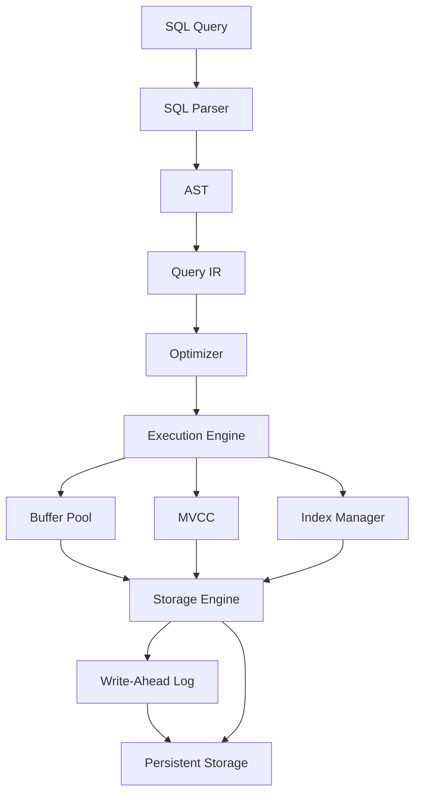
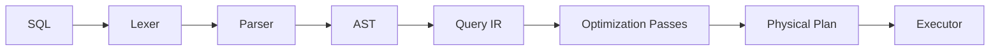
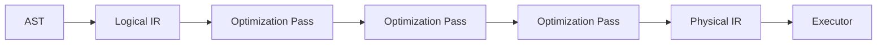
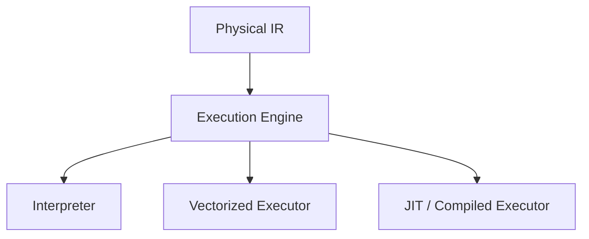
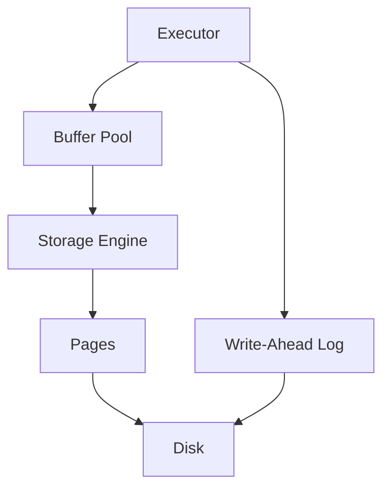
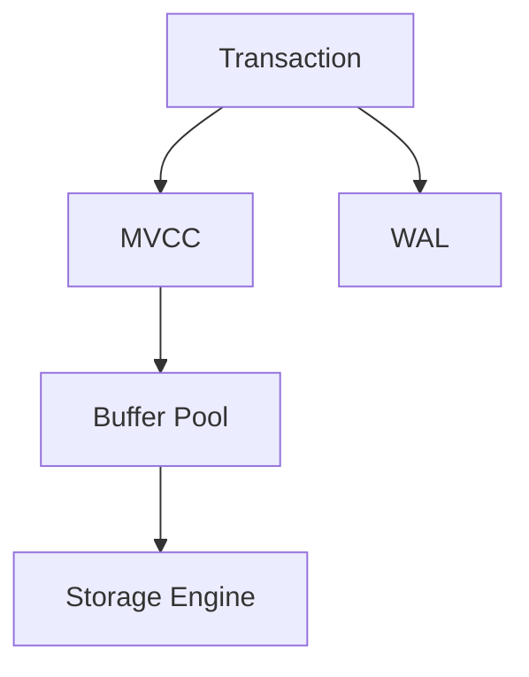

# Crumble Architecture

Crumble is a layered database system with a compiler-inspired query pipeline.

The architecture is intentionally incremental. Components will be introduced as the project evolves.

## High-Level Architecture

## Query Pipeline

The query pipeline transforms SQL into an executable representation.

## Query IR

The Query IR is the central representation between query parsing and execution.

The goal is to make query transformations explicit and independently testable.

The IR is inspired by compiler intermediate representations, particularly the idea of transforming a program through a sequence of well-defined representations and optimization passes.

## Execution

Crumble should eventually support experimentation with different execution strategies.

The same query representation should be capable of being executed using different strategies.

This allows execution techniques to be compared without changing the SQL or storage layers.

## Storage

The storage subsystem is responsible for turning logical database operations into persistent data.

## Transactions and MVCC

Transactions introduce visibility and concurrency semantics over the storage layer.

The exact transaction and versioning model will evolve as the implementation progresses.

## Architectural Principles

### Separation of Concerns

Query processing, execution, concurrency, and storage should have clear boundaries.

### Explicit Representations

Important transformations should use explicit representations rather than being hidden inside large abstractions.

### Composable Optimization

Optimization should be implemented as independently testable passes over the Query IR.

### Experimentation

The architecture should allow alternative execution and storage strategies to be explored without rewriting unrelated components.

### Measure, Don't Assume

Performance-sensitive decisions should be validated through benchmarks and measurements.

### Incremental Complexity

Crumble will grow incrementally. Components should be introduced when their underlying concepts are understood and can be tested.

## Architecture Evolution

This document describes the current and intended architecture.

It is expected to change as Crumble evolves. Architectural changes should be accompanied by a corresponding design document explaining the motivation and tradeoffs behind the change.
