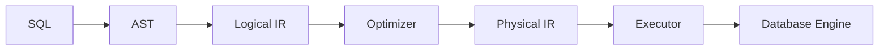
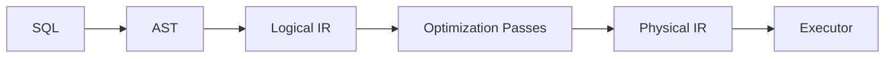
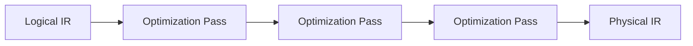
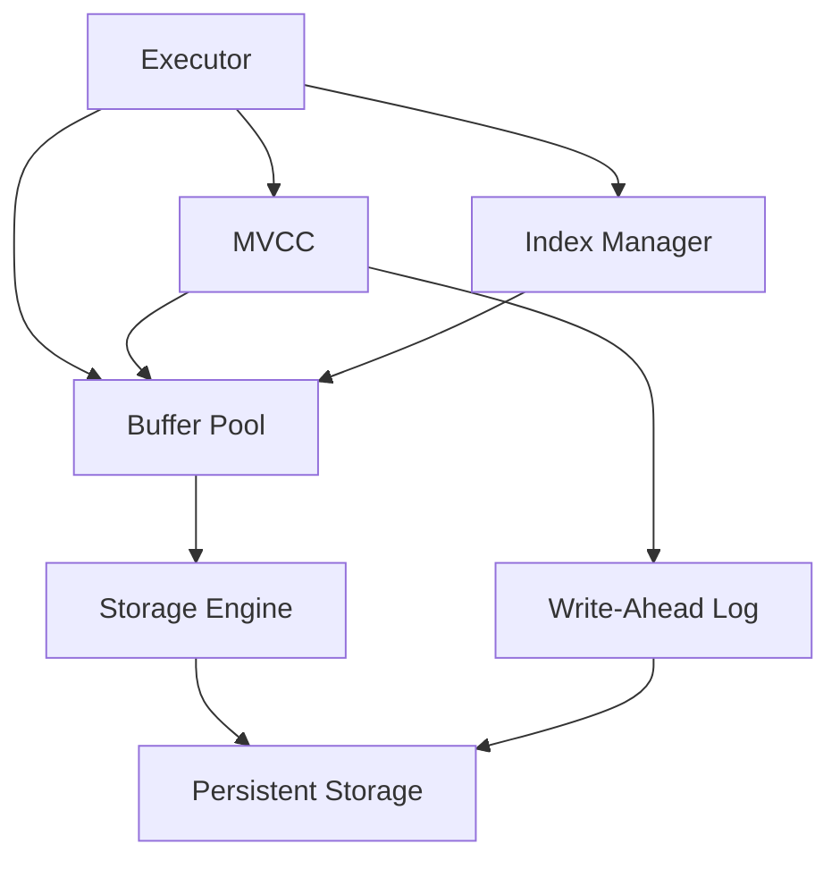
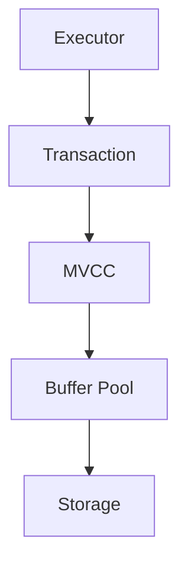
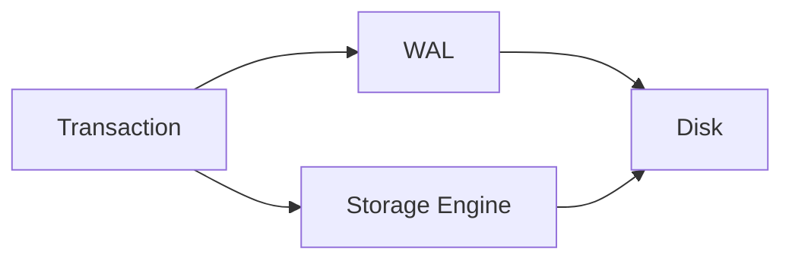
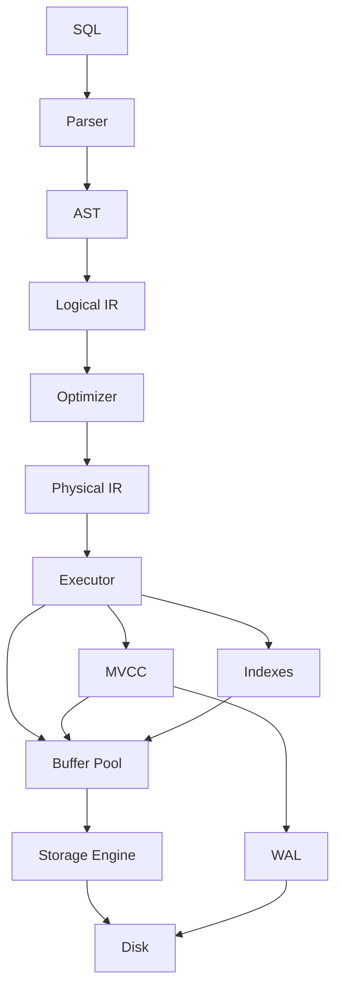
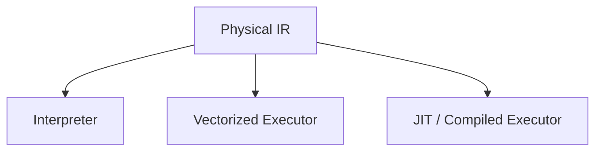

# Crumble Design

Crumble is a database built from first principles in Rust.

The primary goal is learning: understanding how the major pieces of a database work, how they interact, and why production databases make the tradeoffs they do.

Crumble is intentionally designed with a **compiler-inspired query pipeline** while still implementing the traditional database internals underneath it.

---

## The Big Picture

At the highest level, a database takes a query written by a user:

```sql
SELECT name
FROM users
WHERE age > 30;
```

and turns it into operations that retrieve the correct data efficiently.

Crumble separates this process into two major areas:

1. **Query Processing** — understanding and optimizing what the user asked for.
2. **Database Engine** — executing the query and managing data, transactions, memory, and persistence.



---

# 1. Query Processing

The query-processing pipeline is responsible for turning SQL into something the database can execute.



The important idea is that each stage has a different responsibility.

---

## 1.1 SQL Parser

The parser answers:

> **What did the user write?**

Given:

```sql
SELECT name
FROM users
WHERE age > 30;
```

the parser produces an AST representing the structure of the SQL.

Conceptually:

```text
SELECT
  column: name
  table: users
  filter:
    age > 30
```

The parser should not be responsible for deciding whether to use an index or how the data will be physically retrieved.

It understands syntax.

---

## 1.2 Logical IR

The AST still represents SQL syntax.

Crumble converts that representation into a **logical intermediate representation**.

For the same query:

```text
Scan(users)
    ↓
Filter(age > 30)
    ↓
Project(name)
```

This represents the **meaning of the query**, rather than the syntax used to express it.

The logical IR answers:

> **What does the user want the database to do?**

At this stage, we intentionally avoid committing to specific physical implementation details.

---

# 2. Optimization

The optimizer transforms the logical representation into a more efficient representation.

This is where Crumble takes inspiration from compiler architecture.

Instead of implementing optimization as one large function, optimization is composed of independent passes.



Possible passes include:

* Predicate simplification
* Filter pushdown
* Projection pushdown
* Constant folding
* Join reordering
* Index selection
* Physical operator selection

For example, the logical plan might initially be:

```text
Scan(users)
    ↓
Filter(age > 30)
    ↓
Project(name)
```

If an index exists on `age`, an optimization pass may transform it into:

```text
IndexScan(users, age > 30)
    ↓
Project(name)
```

The important concept is that **the IR is transformed through a sequence of explicit passes**.

This is one of the core ideas behind Crumble.

---

# 3. Physical IR

After optimization, the database needs a representation that describes **how the query will actually execute**.

For example:

```text
IndexScan(users, age > 30)
    ↓
Project(name)
```

This is the physical representation of the query.

The physical IR can describe concrete execution operators such as:

* Sequential scan
* Index scan
* Filter
* Projection
* Hash join
* Nested-loop join
* Sort
* Aggregate

The distinction is:

```text
Logical IR
    ↓
"What should happen?"

Physical IR
    ↓
"How should it happen?"
```

---

# 4. Execution

The executor takes the physical representation and actually runs it.


For example:

```text
IndexScan
    ↓
Project
```

The executor evaluates these operators and requests the required data from the database engine.

The executor should not need to understand SQL syntax.

By this point, SQL has already been transformed into an executable representation.

---

# 5. The Database Engine

The executor is where the query-processing world meets the database-engine world.

The database engine is responsible for things such as:

* Data access
* Buffer management
* Storage
* Indexes
* Transactions
* MVCC
* Durability
* Recovery



These components solve different problems.

---

# 6. Buffer Pool

The executor should not directly read and write arbitrary disk locations.

Instead, database pages are managed through a buffer pool.

```text
Executor
    ↓
Buffer Pool
    ↓
Storage Engine
    ↓
Disk
```

The buffer pool is responsible for keeping database pages in memory and deciding which pages need to be loaded or evicted.

Eventually this will involve concepts such as:

* Page caching
* Pinning
* Dirty pages
* Eviction
* Flushing

---

# 7. Storage Engine

The storage engine manages how database data is physically represented.

It is responsible for concepts such as:

* Pages
* Tuples
* Files
* Record layout
* Serialization
* Free space
* Persistent storage

The storage layer answers:

> **How is the data physically stored?**

The query layer answers:

> **What data do we want?**

Keeping those concerns separate is important.

---

# 8. Indexes

Indexes provide alternative ways of finding data without scanning every record.

For example:

```text
Query
  ↓
Optimizer
  ↓
IndexScan(users, age > 30)
  ↓
Index
  ↓
Buffer Pool
  ↓
Storage
```

Crumble can eventually explore multiple index structures, such as B+ trees.

The optimizer decides whether using an index is beneficial.

---

# 9. Transactions and MVCC

Transactions introduce another dimension to execution.

Consider two transactions accessing the same data simultaneously.

The database needs to answer:

> **Which version of the data should this transaction see?**

MVCC provides multi-version concurrency control.

Conceptually:



MVCC is therefore not simply another query-planning stage.

It is part of the database engine that determines **visibility and concurrency** during execution.

---

# 10. Write-Ahead Logging

Durability requires the database to survive crashes.

When modifying data, Crumble will eventually use a write-ahead log.

The basic idea is:



Before a modified page is considered durably persisted, the corresponding log information must satisfy the WAL protocol.

The WAL will eventually also provide the foundation for crash recovery.

---

# 11. Putting Everything Together

The complete mental model is:



The pipeline can therefore be summarized as:

```text
SQL
 ↓
Parser
 ↓
AST
 ↓
Logical IR
 ↓
Optimization Passes
 ↓
Physical IR
 ↓
Executor
 ↓
MVCC / Indexes / Buffer Pool
 ↓
Storage Engine
 ↓
Disk
```

---

# 12. Why an LLVM-Inspired Design?

Crumble does not aim to reproduce LLVM.

Instead, it borrows a useful idea from compiler architecture:

> **Use explicit intermediate representations and transformations between stages.**

A compiler might look conceptually like:

```text
Source Code
    ↓
AST
    ↓
IR
    ↓
Optimization Passes
    ↓
Machine Code
```

Crumble applies a similar idea to databases:

```text
SQL
    ↓
AST
    ↓
Logical IR
    ↓
Optimization Passes
    ↓
Physical IR
    ↓
Execution
```

This makes query optimization explicit and gives Crumble a foundation for experimenting with different execution strategies.

---

# 13. Future Experiments

Because the execution boundary is explicit, Crumble can eventually experiment with multiple execution engines.



This could allow experiments with:

* Interpreted execution
* Vectorized execution
* LLVM-based JIT compilation
* Alternative query representations
* Different optimization strategies
* Learned indexes
* Alternative storage layouts

These experiments are part of the reason for designing Crumble around explicit representations rather than tightly coupling SQL parsing directly to storage operations.

---

# 14. Design Principles

### Learn the mechanism

Every major component should exist because we understand the problem it solves.

### Make transformations explicit

Important changes to a query should be represented as explicit transformations of the IR.

### Keep layers independent

SQL parsing should not depend on storage internals. Storage should not need to understand SQL.

### Prefer measurable decisions

Performance assumptions should be validated through benchmarks.

### Build incrementally

Crumble should start small and grow as each subsystem becomes understandable.

### Document the why

When an architectural decision involves a meaningful tradeoff, the reasoning should be recorded in the design documentation.

---

## The Core Idea

Crumble is not simply:

> **"Let's implement a database."**

The project is an exploration of two systems working together:

```text
          QUERY PROCESSING
          
SQL → AST → IR → Optimization → Execution
                             
                    │
                    ▼

          DATABASE ENGINE

MVCC → Buffer Pool → Storage → WAL → Disk
```

The first half explores **how queries can be represented and transformed**.

The second half explores **how data can be executed, stored, synchronized, and made durable**.

The interesting engineering happens at the boundary between the two.
